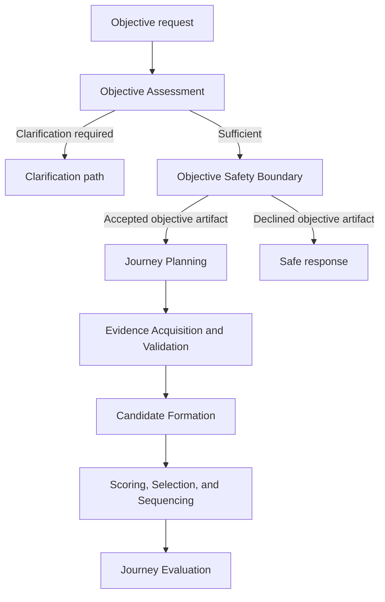

# Architecture

## Shape

The application is a modular local monolith. SQLite stores durable user data;
Pydantic owns boundary schemas; SQLAlchemy owns persistence. Services depend on
repository interfaces rather than UI or AI-provider behavior.

## Layer boundaries

- `taste`: rating vocabulary, preference policy, repositories, and services.
- `elicitation`: immutable, closed-world questionnaire seed artifacts derived
  only from explicit supplied evidence and approved fixed local rules.
- `objective_assessment`: immutable, pure observation of whether validated
  objective evidence covers the fixed construction-readiness dimensions;
  missing dimensions map only to documented clarification prompts.
- Objective Safety Boundary: schema `1.0` defines immutable accepted and declined
  artifacts with fixed reasons and canonical serialization. The provider-neutral
  safety evaluator and policy execution remain unimplemented.
- Evidence acquisition (external boundary): future source-specific adapters end
  at an immutable, source-neutral `EvidenceSnapshot`; no adapter belongs to the
  deterministic core.
- `track_evidence`: deterministic validation and complete partitioning of an
  evidence snapshot without provider access, Candidate Formation, or sequencing.
- Candidate Formation: CF-0 defines the join, CF-1 supplies immutable source
  evidence, and CF-2 performs exact correspondence, hard eligibility, versioned
  preference derivation, and complete formed/withheld partitioning. CF-3
  downstream integration remains unimplemented.
- `journey` (Phase 2): request interpretation and phase allocation.
- `sequencing` (Phases 3–4): candidate scoring, selection, and deterministic
  sequential construction.
- `evaluation` (Phase 5): immutable observation of journey-level construction
  outcomes without sequence modification.
- `refinement` (Phase 6): bounded evidence-driven revision that consumes
  construction and evaluation without redefining either.
- API/UI (Phase 7): thin adapters over application services.
- `providers` (Phase 8): optional AI assistance behind a small interface.

Hard rules such as `Forbidden`, `Pencil`, and default `No Thanks` exclusion are
code-level policy. A future AI provider may propose candidates but cannot bypass
policy.

## Reasoning flow

Objective Safety evaluates intent before musical work begins. The accepted path
alone reaches Journey Planning. The declined path is terminal for soundtrack
construction and does not access evidence providers or musical layers. See
[Objective Safety Boundary](objective_safety.md) for the design contract.

Candidate Formation is the only boundary authorized to construct a
`TrackCandidate` from validated source artifacts. Every formed field must trace
to immutable evidence or a named versioned derivation rule with recorded inputs.
Hard exclusions produce withheld entries and never become scoring penalties. See
[Candidate Formation Contract](candidate_formation.md).

## Extensibility decisions

`ArtistRating` stores overall preference only. The schema already defines separate
track and context feedback concepts so a later context score will not rewrite an
artist preference. SQLite initialization currently uses `create_all` plus
idempotent seeds; a migration tool will be added before schema evolution ships.

## Product and deployment boundary

Penny's local-first architecture supports one deterministic reasoning engine
across its deployment models. Optional connected services may add convenience,
continuity, and collaboration, but must not provide better reasoning or better
soundtrack quality. See [Product Strategy](product_strategy.md) for the governing
product principles and deployment-model distinction.
