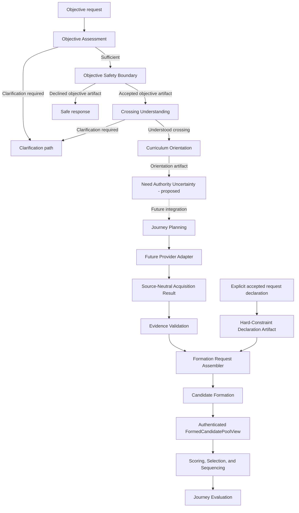

# Architecture

## Shape

The application is a modular local monolith. SQLite stores durable user data;
Pydantic owns boundary schemas; SQLAlchemy owns persistence. Services depend on
repository interfaces rather than UI or AI-provider behavior.

## Layer boundaries

- `taste`: rating vocabulary, preference policy, repositories, and services.
- `elicitation`: immutable, closed-world questionnaire seed artifacts derived
  only from explicit supplied evidence and approved fixed local rules.
- `objective_assessment`: immutable, pure observation of whether validated
  objective evidence covers the fixed construction-readiness dimensions;
  missing dimensions map only to documented clarification prompts.
- Objective Safety Boundary: schema `1.0` defines immutable accepted and declined
  artifacts with fixed reasons and canonical serialization. The provider-neutral
  safety evaluator and policy execution remain unimplemented.
- `crossing_understanding` (CU-1): derives one directional crossing exclusively
  from exact EA-1 authenticated characteristics. Other lived evidence and need
  lineage are preserved without participating in directional reasoning.
- `curriculum_orientation` (CU-2): exact, closed-world orientation from one
  resolved CU-1 transition through a canonical digest-bound registry of three
  approved rules. Output conditions remain unresolved orientation candidates
  and cannot establish person applicability, diagnosis, membership, or need.
- Evidence acquisition (external boundary): future source-specific adapters end
  at an immutable `SourceNeutralAcquisitionResult` containing the exact source
  receipt, adapter identity/version, capability declaration, source-neutral
  `EvidenceSnapshot`, and corresponding candidate identity metadata. The
  contract exists; no provider adapter is implemented.
- `track_evidence`: deterministic validation and complete partitioning of an
  evidence snapshot without provider access, Candidate Formation, or sequencing.
- Candidate Formation: CF-0 defines the join, CF-1 supplies immutable source
  evidence, and CF-2 performs exact correspondence, hard eligibility, versioned
  preference derivation, and complete formed/withheld partitioning. The accepted
  CF-3 integrates that artifact through an authenticated formed-only view and
  traced ranking envelope with no raw-candidate production path.
- `journey` (Phase 2): request interpretation and phase allocation.
- `sequencing` (Phases 3–4): candidate scoring, selection, and deterministic
  sequential construction.
- `evaluation` (Phase 5): immutable observation of journey-level construction
  outcomes without sequence modification.
- `refinement` (Phase 6): bounded evidence-driven revision that consumes
  construction and evaluation without redefining either.
- API/UI (Phase 7): thin adapters over application services.
- `providers` (Phase 8): optional AI assistance behind a small interface.

Hard rules such as `Forbidden`, `Pencil`, and default `No Thanks` exclusion are
code-level policy. A future AI provider may propose candidates but cannot bypass
policy.

## Reasoning flow

Objective Safety evaluates intent before musical work begins. The accepted path
alone reaches Crossing Understanding and later Journey Planning. The declined path is terminal for soundtrack
construction and does not access evidence providers or musical layers. See
[Objective Safety Boundary](objective_safety.md) for the design contract.

Crossing Understanding implements the first four steps of Penny's listening
sequence without selecting accompaniment or music. Events and metaphors are
evidence, not classifier labels; recurring conditions orient understanding but
do not define the person. See the [Crossing Model](curriculum/crossing_model.md)
and [CU-1 contract](curriculum/crossing_understanding.md).

Curriculum Orientation applies only exact authenticated-characteristic
predicates to the resolved crossing. It never reads observation payloads, event
labels, metaphors, needs, or prior orientation candidates. No matching rule is
an honest closed-world result. CU-2 is
implemented additively; its CU-3 successor and downstream Journey Planning
integration remain unimplemented. See the
[CU-2 contract](curriculum/curriculum_orientation.md).

Need Authority Uncertainty (CU-3) is proposed as an epistemic boundary that
identifies the smallest material blocker between orientation and person-specific
need authority. It does not generate questions or establish a need. Contract
review discovered that authenticated person-specific evidence and an immutable
need-authority requirements registry are missing upstream authorities, so CU-3
implementation is prohibited pending those prerequisite contracts. See the
[CU-3 contract](curriculum/need_authority_uncertainty.md).

Need Authority Requirements is the proposed case-blind normative prerequisite
for CU-3. It defines immutable conditional sufficiency criteria without
inspecting evidence or asserting truth. Requirement authority remains independent
of evidence authority until a separately authorized conformance boundary applies
both. See the
[Need Authority Requirements contract](curriculum/need_authority_requirements.md).

Candidate Formation is the only boundary authorized to construct a
`TrackCandidate` from validated source artifacts. Every formed field must trace
to immutable evidence or a named versioned derivation rule with recorded inputs.
Hard exclusions produce withheld entries and never become scoring penalties. See
[Candidate Formation Contract](candidate_formation.md).

The request assembler is the source-neutral authority join before Candidate
Formation. It accepts already-governed acquisition, validation, declaration,
taste, feature, context, objective, journey, and policy artifacts. It cannot
read free-form prose or call providers. The Maestro Workbench remains a separate
research-intake system: OCR and draft extraction are not product metadata or
constraint authority and do not feed this path.

CF-3 makes `FormedCandidatePoolView` the sole production boundary from Candidate
Formation into selection and construction. It is derived only from a validated
`CandidateFormationArtifact`, projects only formed entries, retains their
provenance, and identifies the exact complete parent through the SHA-256 digest
of its canonical bytes. Selector and constructor integration may not accept raw
candidate pools. See the
[Candidate Formation Integration Contract](candidate_formation_integration.md).

## Extensibility decisions

`ArtistRating` stores overall preference only. The schema already defines separate
track and context feedback concepts so a later context score will not rewrite an
artist preference. SQLite initialization currently uses `create_all` plus
idempotent seeds; a migration tool will be added before schema evolution ships.

## Product and deployment boundary

Penny's local-first architecture supports one deterministic reasoning engine
across its deployment models. Optional connected services may add convenience,
continuity, and collaboration, but must not provide better reasoning or better
soundtrack quality. See [Product Strategy](product_strategy.md) for the governing
product principles and deployment-model distinction.
