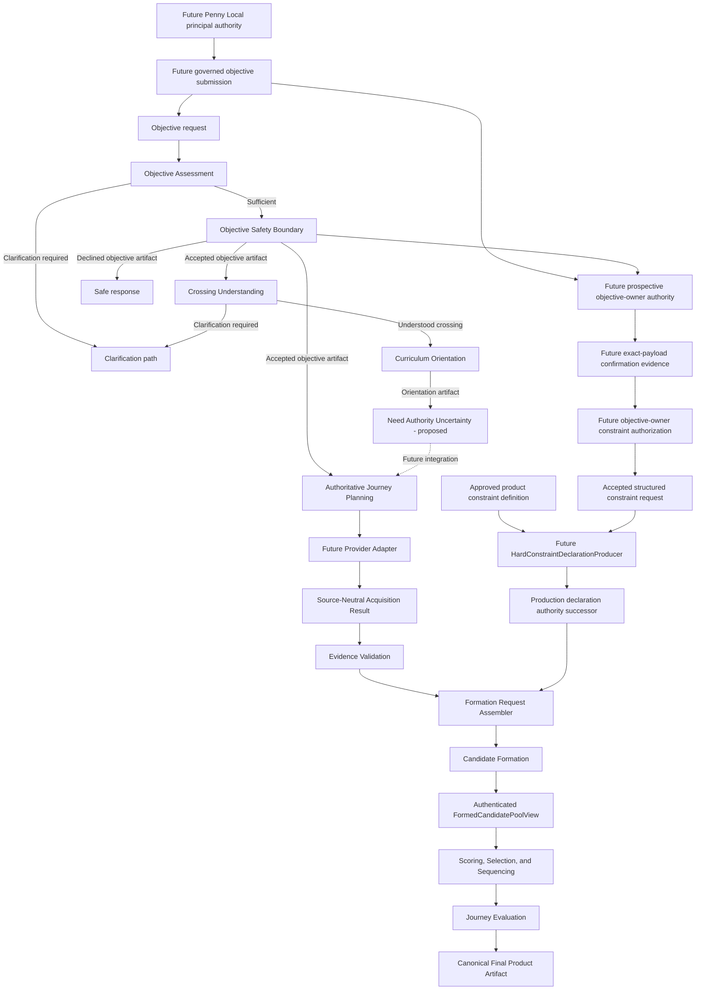

# Architecture

## Shape

The application is a modular local monolith. SQLite stores durable user data;
Pydantic owns boundary schemas; SQLAlchemy owns persistence. Services depend on
repository interfaces rather than UI or AI-provider behavior.

## Layer boundaries

- `taste`: rating vocabulary, preference policy, repositories, and services.
- `elicitation`: immutable, closed-world questionnaire seed artifacts derived
  only from explicit supplied evidence and approved fixed local rules.
- `objective_assessment`: immutable, pure observation of whether validated
  objective evidence covers the fixed construction-readiness dimensions;
  missing dimensions map only to documented clarification prompts.
- Objective Safety Boundary: schema `2.0` defines immutable accepted and declined
  artifacts with fixed reasons and canonical serialization. The implemented
  provider-neutral evaluator is the sole production decision authority for the
  frozen `pne.objective-safety.playlist-intent/1.0` policy.
- `crossing_understanding` (CU-1): derives one directional crossing exclusively
  from exact EA-1 authenticated characteristics. Other lived evidence and need
  lineage are preserved without participating in directional reasoning.
- `curriculum_orientation` (CU-2): exact, closed-world orientation from one
  resolved CU-1 transition through a canonical digest-bound registry of three
  approved rules. Output conditions remain unresolved orientation candidates
  and cannot establish person applicability, diagnosis, membership, or need.
- Evidence acquisition (external boundary): future source-specific adapters end
  at an immutable `SourceNeutralAcquisitionResult` containing the exact source
  receipt, adapter identity/version, capability declaration, source-neutral
  `EvidenceSnapshot`, and corresponding candidate identity metadata. The
  contract exists; no provider adapter is implemented. One narrow observation-
  only interface, capture point, receipt policy, and canonical profile are
  frozen as executable definitions. An observation-only Source Receipt producer
  now creates canonical request-reproducible receipts, but no conforming source
  implementation, provider adapter, or source-neutral acquisition producer
  exists yet. The documentation-only
  [Penny Local iTunes Windows XML acquisition contract](penny_local_itunes_windows_xml_acquisition.md)
  freezes the first source-specific profile, governed local file-selection
  authority, deterministic mapping, and a separate immutable wrapper around
  schema `1.0`; it changes no runtime behavior.
- `track_evidence`: deterministic validation and complete partitioning of an
  evidence snapshot without provider access, Candidate Formation, or sequencing.
- Candidate Formation: CF-0 defines the join, CF-1 supplies immutable source
  evidence, and CF-2 performs exact correspondence, hard eligibility, versioned
  preference derivation, and complete formed/withheld partitioning. The accepted
  CF-3 integrates that artifact through an authenticated formed-only view and
  traced ranking envelope with no raw-candidate production path. Candidate
  Constraint Evaluation v1 supplies the contract-frozen explicit predicate
  registry and declaration schema `2.0`; existing declaration schema `1.0`
  retains exact typed equality and canonical meaning. The
  [Accepted Constraint Declaration Authority v1](accepted_constraint_declaration_authority.md)
  contract freezes the future structured-request and approved-definition chain
  for production declaration authority. The dedicated
  [Objective-Owner Constraint Authorization Evidence v1](objective_owner_constraint_authorization_evidence.md)
  contract separately freezes the principal, exact-payload, governed-method,
  and underlying-evidence authority required before a request can be accepted.
  Penny Local v1 now supplies contract-frozen, jurisdictionally separate
  prerequisites for [local principal identity](penny_local_principal_authority.md),
  [prospective accepted-objective ownership](accepted_objective_owner_authority.md),
  and [exact-payload explicit confirmation](local_explicit_constraint_confirmation_evidence.md).
  All three new authority producers and schemas, the successor formation chain,
  and the first approved product definition remain unimplemented.
- `journey` (Phase 2): a verified accepted Objective Safety result and the exact
  authenticated Objective Assessment input evidence authorize deterministic
  phase allocation. `JourneyPlanArtifact` schema `2.0` binds the assessment,
  safety request, accepted decision, intent and policy lineage, planning values,
  and resulting plan by canonical SHA-256. Direct schema construction is not a
  production authority.
- `sequencing` (Phases 3–4): candidate scoring, selection, and deterministic
  sequential construction. Each result binds the exact journey artifact,
  authenticated formed-parent digest, canonical construction policy, and
  pre-call resumable-state authority used during that construction call.
- `evaluation` (Phase 5): immutable observation of journey-level construction
  outcomes without sequence modification. Evaluation schema `2.0` binds the
  exact construction-result, journey-artifact, and construction-policy digests
  at evaluation time; metric calculations remain unchanged.
- `product_artifact`: canonical product-domain finalization of the exact journey,
  authenticated formed authority, policy, construction, evaluation, and ordered
  placements. Refinement is honestly recorded as `NOT_PERFORMED`; no refinement
  algorithm is implemented.
- `refinement` (future): any bounded evidence-driven revision must consume the
  authenticated formed authority plus construction and evaluation without
  redefining them.
- API/UI (Phase 7): thin adapters over application services.
- `providers` (Phase 8): optional AI assistance behind a small interface.

Hard rules such as `Forbidden`, `Pencil`, and default `No Thanks` exclusion are
code-level policy. A future AI provider may propose candidates but cannot bypass
policy.

## Reasoning flow

Objective Safety evaluates intent before musical work begins. The accepted path
alone may authorize Journey Planning. The declined path is terminal for soundtrack
construction and does not access evidence providers or musical layers. See
[Objective Safety Boundary](objective_safety.md) for the design contract.

The legacy `pne plan-focus` command is explicitly a non-authoritative planning
demo. It performs neither Objective Assessment nor Objective Safety and cannot
produce an authoritative `JourneyPlanArtifact`.

Crossing Understanding implements the first four steps of Penny's listening
sequence without selecting accompaniment or music. Events and metaphors are
evidence, not classifier labels; recurring conditions orient understanding but
do not define the person. See the [Crossing Model](curriculum/crossing_model.md)
and [CU-1 contract](curriculum/crossing_understanding.md).

Curriculum Orientation applies only exact authenticated-characteristic
predicates to the resolved crossing. It never reads observation payloads, event
labels, metaphors, needs, or prior orientation candidates. No matching rule is
an honest closed-world result. CU-2 is
implemented additively; its CU-3 successor and downstream Journey Planning
integration remain unimplemented. See the
[CU-2 contract](curriculum/curriculum_orientation.md).

Need Authority Uncertainty (CU-3) is proposed as an epistemic boundary that
identifies the smallest material blocker between orientation and person-specific
need authority. It does not generate questions or establish a need. Contract
review discovered that authenticated person-specific evidence and an immutable
need-authority requirements registry are missing upstream authorities, so CU-3
implementation is prohibited pending those prerequisite contracts. See the
[CU-3 contract](curriculum/need_authority_uncertainty.md).

Need Authority Requirements is the proposed case-blind normative prerequisite
for CU-3. It defines immutable conditional sufficiency criteria without
inspecting evidence or asserting truth. Requirement authority remains independent
of evidence authority until a separately authorized conformance boundary applies
both. See the
[Need Authority Requirements contract](curriculum/need_authority_requirements.md).

Candidate Formation is the only boundary authorized to construct a
`TrackCandidate` from validated source artifacts. Every formed field must trace
to immutable evidence or a named versioned derivation rule with recorded inputs.
Hard exclusions produce withheld entries and never become scoring penalties. See
[Candidate Formation Contract](candidate_formation.md) and the
[Candidate Constraint Evaluation v1 contract](candidate_constraint_evaluation.md).
The first governed manual source for the six missing Active Focus readiness
dimensions is frozen in the
[Active Focus Candidate-Readiness Vocabulary v1](active_focus_candidate_readiness_vocabulary.md);
runtime implementation and a suitable real multi-artist proof input remain
unestablished.

The request assembler is the source-neutral authority join before Candidate
Formation. It accepts already-governed acquisition, validation, declaration,
taste, feature, context, objective, journey, and policy artifacts. It cannot
read free-form prose or call providers. The Maestro Workbench remains a separate
research-intake system: OCR and draft extraction are not product metadata or
constraint authority and do not feed this path.

For future production declarations, structural validity is not authorization.
The assembler must independently verify the accepted objective, accepted
structured request, its exact authorization artifact, approved definition,
parameters, and producer output under
[Accepted Constraint Declaration Authority v1](accepted_constraint_declaration_authority.md)
and [Objective-Owner Constraint Authorization Evidence v1](objective_owner_constraint_authorization_evidence.md).
Direct schema `2.0` construction remains historical/test machinery and cannot
self-authorize a production constraint.

CF-3 makes `FormedCandidatePoolView` the sole production boundary from Candidate
Formation into selection and construction. It is derived only from a validated
`CandidateFormationArtifact`, projects only formed entries, retains their
provenance, and identifies the exact complete parent through the SHA-256 digest
of its canonical bytes. Selector and constructor integration may not accept raw
candidate pools. See the
[Candidate Formation Integration Contract](candidate_formation_integration.md).

## Extensibility decisions

`ArtistRating` stores overall preference only. The schema already defines separate
track and context feedback concepts so a later context score will not rewrite an
artist preference. SQLite initialization currently uses `create_all` plus
idempotent seeds; a migration tool will be added before schema evolution ships.

## Product and deployment boundary

Penny's local-first architecture supports one deterministic reasoning engine
across its deployment models. Optional connected services may add convenience,
continuity, and collaboration, but must not provide better reasoning or better
soundtrack quality. See [Product Strategy](product_strategy.md) for the governing
product principles and deployment-model distinction.
